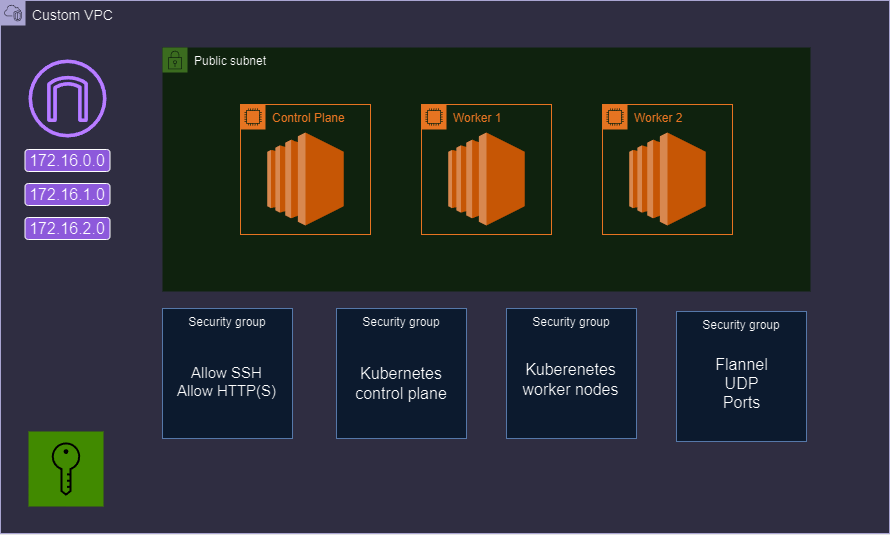

# Play with Ansible and Terraform to make Self managed K8s Cluster

## Description
This project automates the deployment of a Kubernetes cluster on AWS EC2 instances using Terraform for infrastructure provisioning and Ansible for installing Docker, kubeadm, and all necessary dependencies.

## Prerequisites
Ensure you have the following installed and configured on your device:
- [AWS CLI](https://docs.aws.amazon.com/cli/latest/userguide/install-cliv2.html)
- [Terraform](https://learn.hashicorp.com/tutorials/terraform/install-cli)
- [Ansible](https://docs.ansible.com/ansible/latest/installation_guide/intro_installation.html)
- [kubectl](https://kubernetes.io/docs/tasks/tools/install-kubectl/)
- [Helm](https://helm.sh/docs/intro/install/)
## Basic Kubeadm Cluster Diagram


## Installation
1. Clone the repository:
   ```sh
   git clone https://github.com/AB-Rhman/k8s-ec2-terrafrom.git
   cd k8s-ec2-terrafrom
   ```

## Usage
### Provision Infrastructure
1. Initialize Terraform:
   ```sh
   terraform init
   ```

2. Review the execution plan:
   ```sh
   terraform plan
   ```

3. Apply the Terraform configuration:
   ```sh
   terraform apply
   ```

### SSH Access
1. Use the generated private key to SSH into your EC2 instances:
   ```sh
   ssh -i privatekey.pem ubuntu@<ec2-public-ip> # find ip in /files/hosts
   ```

### Run Ansible Playbook
1. Ensure required Ansible packages are installed:
   ```sh
   ansible-galaxy install -r requirements.yml
   ansible-galaxy collection install cloud.terraform
   ```

2. Create an Ansible vault file with your sudo password:
   ```sh
   ansible-vault create vault.yml
   ```
   Inside the `vault.yml` file, add:
   ```yaml
   ansible_become_pass: <your_sudo_password>
   ```

3. Run the Ansible playbook:
   ```sh
   ansible-playbook -i inventory.yml playbook.yml --ask-vault-pass
   ```

> ### OR You can use apply script to make all of the above
   ```sh
   ./apply-and-run-k8s.sh
   ```

### Configure kubectl
1. Export the kubeconfig file:
   ```sh
   export KUBECONFIG=/tmp/kubeconfig/config
   ```

2. Verify the connection to your Kubernetes cluster:
   ```sh
   kubectl get nodes
   ```

>### Clean Up
1. Destroy all resources:
   ```sh
   ./destroy-all.sh
   ```

## Features
- Automated Kubernetes cluster deployment on AWS EC2 instances
- Infrastructure provisioning with Terraform
- Configuration management with Ansible
- Easy setup and teardown with provided scripts

## Contributing
Contributions are welcome! Please open an issue or submit a pull request for any changes or enhancements.

## Contact Information
For questions or feedback, please open an issue on the repository or contact the project maintainer.
